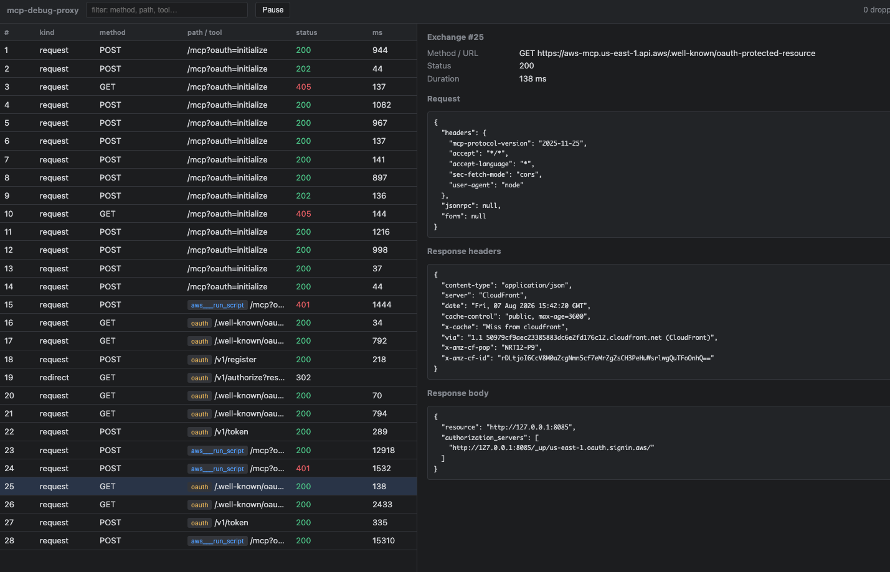

# MCP debug proxy
[English](README.md)

MCP クライアント（Claude Desktop、Kiro など）と**サードパーティのリモート
MCP サーバー**の間に立つリバースプロキシです。トラフィックを透過的に中継し、
すべての JSON-RPC のやり取りを JSONL 監査ログとして記録し、OAuth の
ディスカバリメタデータを書き換えて、登録（DCR）＋トークンのやり取りも
プロキシ経由になる（＝ログに残る）ようにします。

MCP クライアントとリモート MCP サーバーが実際に何をやり取りしているか
を、OAuth のやり取りも含めて、パケットスニファやクライアント内蔵の
デバッガなしで確認するために使います。

これはトランスポート変換プロキシ**ではありません**（`mcp-remote` のような
stdio↔HTTP ブリッジはすでにそれをうまくやっています）。このツールの仕事は
ただ一つ、MCP + OAuth のトラフィックを、内容を変えずにログとして可視化する
ことです。

## <a id="requirements"></a>Requirements（動作要件）

- Python 3.9+
- macOS または Linux（macOS で動作確認済み）

## <a id="installation"></a>Installation（インストール）

```bash
git clone <this-repo-url>
cd mcp-debug-proxy

python3 -m venv venv
source venv/bin/activate      # Windows: venv\Scripts\activate

pip install -r requirements.txt
```

## <a id="configuration"></a>Configuration（設定）

プロキシの設定はすべて環境変数で行います。設定ファイルはありません。

| 変数名 | デフォルト | 意味 |
|----------------|---------------------------------|------------------------------------------------------------------|
| `UPSTREAM`     | `https://mcp.example.com/mcp`  | 監視したいリモート MCP サーバー（フルのエンドポイント URL）。 |
| `PROXY_PUBLIC` | `http://localhost:8080`        | クライアントがこのプロキシにアクセスする際のベース URL。`localhost:8080` 以外で動かす場合（例: 別ポートへの SSH トンネル経由）のみ変更してください。 |
| `LOG_PATH`     | `mcp_proxy.jsonl`               | JSONL 監査ログの書き込み先。                            |
| `ALLOWED_AUTH_HOSTS` | *(未設定)*                | 実行時の OAuth ディスカバリが渡してくるホストに加えて、`/_up/{host}` を通すことを許可する IdP ホストをカンマ区切りで指定します。プロキシ再起動後にクライアントがディスカバリをスキップしてしまう場合（例: キャッシュ済みのリフレッシュトークンを再利用する場合）に、無用な 403 を避けるのに便利です。`UPSTREAM` 自身のホストは常に許可されます。 |
| `HISTORY_SIZE` | `500`                     | 遅れて接続してきた UI に対して `/events` がバックフィルする、過去の exchange 単位レコードの件数（古い順）。`stream_chunk` レコードはこの件数にはカウントされません。 |
| `EVENTS_QUEUE_MAXSIZE` | `512`             | ライブ `/events` フィードにおける購読者ごとのキューサイズ。UI タブが遅かったり詰まったりしても、プロキシ本体をブロックせず、そのタブ自身の一番古いキュー済みレコードが捨てられるだけです。 |
| `EVENTS_STATS_INTERVAL` | `15`             | アイドル状態の `/events` 接続に送る、ハートビートイベント（ライブのドロップ件数カウンタも兼ねる）の送信間隔（秒）。 |
| `OPEN_UI`      | *(未設定、無効)*                  | `1`/`true`/`yes` を設定すると、起動時に `/ui` を自動的にブラウザウィンドウで開きます。デフォルトでは無効です — [Live debug UI（ライブデバッグ UI）](#live-debug-ui) を参照。 |

## <a id="running"></a>Running（起動）

```bash
source venv/bin/activate
UPSTREAM=https://mcp.example.com/mcp uvicorn proxy:app --port 8080
```

MCP クライアントは `http://localhost:8080/` に向けてください。

`UPSTREAM` は **https** でも構いません — プロキシは httpx 経由で TLS 接続を
行います。プロキシ自身のリスナーだけが localhost 上のプレーン http であり、
これは下記のローカルブリッジが期待している形です。デフォルトでは uvicorn は
`127.0.0.1` にのみバインドします。プロキシ自身のポートには認証がないため、
何をしているか分かっていない限り `--host 0.0.0.0` を渡さないでください（
[Known limitations（既知の制限）](#known-limitations) を参照）。

シングルワーカーで実行してください（デフォルトのままで、`--workers N`
は渡さないでください）。`/_up/{host}` の許可リストはプロセス内メモリに
存在するため、複数のワーカープロセスがあるとそれを共有できず、あるホストを
解禁したディスカバリ通信を見ていないワーカーにリクエストが飛んでしまう
可能性があります。

作業中はログを tail してください:

```bash
tail -f mcp_proxy.jsonl | python3 -m json.tool --json-lines
```

## Wiring Claude Desktop（Claude Desktop との接続、主要な想定用途）

Claude Desktop の**カスタムコネクタは Anthropic のクラウドから接続される
のであって、あなたのマシンからではありません**。そのため `http://localhost`
のコネクタ URL は機能せず、ローカルのプロキシをその経路に割り込ませることは
できません。代わりに `mcp-remote` の stdio ブリッジを使ってください。これは
ローカルで動作し、OAuth 自体を処理し（ブラウザを開いて DCR + トークン交換を
行う）、その HTTP 通信をプロキシ経由で行います:

```
Claude Desktop ─stdio─► mcp-remote (local) ─HTTP─► proxy ─https─► MCP + IdP
```

`claude_desktop_config.json`:

```json
{
  "mcpServers": {
    "target-via-proxy": {
      "command": "npx",
      "args": ["mcp-remote", "http://localhost:8080/", "--transport", "http-only"]
    }
  }
}
```

OAuth の authorize リグはブラウザで開始され、プロキシを一度経由して
（ログに残る）`resource` パラメータを修正した上で、実際のログイン（ログには
残らない）のために IdP へ直接進みます — 詳細は [How the OAuth interception
works（OAuth 傍受の仕組み）](#how-the-oauth-interception-works) を参照。
DCR とトークン交換はプロキシを経由し、ログに残ります。プロキシは
`Origin`/`Referer` ヘッダを上流のオリジンに書き換えるため、DNS リバインディング
/Origin 検証を行うサーバーが中継されたリクエストを拒否することがありません。
クライアント向けの OAuth `resource` の値はプロキシ自身の URL です（クライアント
が接続先の URL と照合する検証を行うために必要）が、実際に IdP へ届くすべての
リクエストの途中で本来のサーバーの URL に書き戻されます。これにより、トークンの
オーディエンスは本来のサーバーに紐づいたままとなり、IdP がそれを受理します —
なぜこの「二つの顔」が必要かについては下記の `resource` の節を参照してください。

実際のリモート MCP サーバー + IdP（AWS の MCP Server、
`aws-mcp.us-east-1.api.aws`）に対してエンドツーエンドで動作確認済みです —
RFC 8414/9728 のディスカバリ、DCR、ブラウザでの認可、トークン交換のすべてが
プロキシ経由で動作しました。

### Kiro

Kiro はローカルマシンからリモートサーバーへ直接接続するため、
`.kiro/settings/mcp.json` でプロキシに直接向けることができます:

```json
{ "mcpServers": { "target-via-proxy": { "url": "http://localhost:8080/" } } }
```

## <a id="how-the-oauth-interception-works"></a>How the OAuth interception works（OAuth 傍受の仕組み）

プロキシはディスカバリメタデータを書き換え、各リグがプロキシへ戻ってくる
ようにします。ブラウザの `/authorize` リグは、最終的には実際のログイン UI
のために直接 IdP と通信します — 私たちはそれを（下記の通り）一度だけの
リダイレクトバウンスで経由させるだけで、ページの内容自体をプロキシする
ことはありません。

```
client ── GET /              ─► proxy ─► MCP server        401 + WWW-Authenticate
       ◄─ resource_metadata rewritten to proxy ───────────┘
client ── GET PR metadata    ─► proxy   (authorization_servers + resource rewritten)
client ── GET AS metadata    ─► proxy   (token/registration/authorization_endpoint
                                         all rewritten)
client ── POST /register     ─► proxy ─► IdP    (DCR logged)
browser ─ GET /_authorize    ─► proxy   (302, `resource` patched back to real value)
browser ─ GET /authorize     ─► IdP            (DIRECT from here — not logged)
client ── POST /token        ─► proxy ─► IdP    (`resource` patched back; code +
                                                  tokens logged, masked)
client ── POST / (tools/call)─► proxy ─► MCP    (tool name + args logged)
```

認可サーバー（Auth-server）側のリグは `/_up/{host}/{path}` 経由でプロキシ
されるため、1 つのプロキシで MCP ホストとその IdP の両方に到達できます。
この書き換えを通じてプロキシ自身がすでに払い出したホストのみが `/_up` を
通ることを許可されます — 未知のホストは 403 になります（[Known
limitations（既知の制限）](#known-limitations) を参照）。`handle_root` は
`/.well-known/xxx/_up/{host}/{rest}` という形（MCP クライアントが
`/_up/{host}` の issuer URL に対して RFC 8414 のパス挿入を適用した際の形）
も認識し、`UPSTREAM` 自身のオリジンに対するルックアップとして扱うのではなく、
well-known のプレフィックスを実際のパスの手前に再挿入した上で本来の
`{host}` へルーティングします。

**`resource` は二つの顔を持ちます。** MCP クライアント（例: `mcp-remote`）は
protected-resource メタデータの `resource` の値を、実際に接続している URL
（＝私たち自身であり、本来のサーバーではない）と照合して検証します。そのため
`rewrite_metadata()` はクライアント向けに `resource` を `PROXY_PUBLIC` に
書き換えます。しかし IdP が発行するトークンは*本来の*サーバーに紐づいて
いなければ実際の API 呼び出しで受理されないため、実際の `/token`
リクエストへ向かう途中で `relay()` が `resource` フォームフィールドを
以前に取得した本来の値に書き戻します。この比較では末尾の `/` を無視します。
クライアントは値をバイト単位でそのままエコーバックするとは限らないため
です（`mcp-remote` が末尾にスラッシュを追加するケースを確認しています）。
トークン/DCR リクエストのフォームフィールドも、JSON ボディと同様にマスクされた
上でログに記録されます。

同じクライアント向けの `resource` の値は、ブラウザが `authorization_endpoint`
に送るクエリ文字列にも現れます — 一部の IdP はそこでも検証を行います
（AWS の実際のエンドポイントに対して確認済み: 本来の `resource` は 302 に
なり、プロキシ自身の URL や `resource` の欠落は 400 になります）。このリグは
ブラウザから IdP へ直接向かい、プロキシを一切経由しないため、パッチを当てる
対象のリクエストが存在しません — そこで `rewrite_metadata()` は代わりに
`authorization_endpoint` を `{PROXY_PUBLIC}/_authorize` に向けます。これは
`resource` を書き換えてブラウザを本来の IdP へそのまま送り出す、一度だけの
302 リダイレクトバウンス（`handle_authorize()`）です。実際のログイン UI は
引き続き本来の IdP がブラウザに直接描画するものであり、私たちを経由しません。

## <a id="live-debug-ui"></a>Live debug UI（ライブデバッグ UI）

プロキシを起動した状態で `http://localhost:8080/ui` を開くと、Charles や
Fiddler のように、やり取りがリアルタイムで発生する様子を確認できます。
`OPEN_UI=1` を設定しておけば、起動時にプロキシが自動でブラウザウィンドウを
開いてくれます: request/response のペアのライブ一覧（method・path・status・所要時間・
tool 名・OAuth リグのバッジ）、クリックで開く詳細ペイン、そして SSE の
tool レスポンスがストリームが閉じるのを待たずにその場でどんどん伸びていく
表示です。これは `GET /events`（`text/event-stream`）によって配信されて
おり、接続時に直近の履歴をバックフィルしてから（上記の `HISTORY_SIZE`
を参照）ライブ配信に切り替わります。`/events` への配信はベストエフォート
です: 遅い、あるいは切断された UI タブは自分自身のキューに溜まった
レコードを落とすだけで、プロキシ本体や他の購読者には一切影響しません。
`/ui` と `/events` はどちらもプロキシの他の部分と全く同じく `127.0.0.1`
にバインドされています — [Known limitations（既知の制限）](#known-limitations)
を参照してください。

詳細ペインには**実際のレスポンス body**（JSON であれば整形表示、例えば
`tools/list` の応答であれば実際の tool 定義そのもの）に加えて**レスポンス
ヘッダ**（`content-type`、`mcp-session-id` など）が表示されます — どちらも
既存のリクエストヘッダ/ボディと同じ方針でマスクされるため、OAuth の
トークンレスポンスの `access_token` もそこでは `***MASKED***` と表示され、
生の値が表示されることはありません。ブラウザが自動的に送る
`/favicon.ico` へのリクエストはプロキシが直接応答します（204、上流へは
転送しません）ので、一覧が汚れることはありません。



## <a id="log-format"></a>Log format（ログのフォーマット）

1 行 1 JSON オブジェクトです。リクエストのレコードの後に、対になる
レスポンスのレコード（同じ `exchange_id`）が続きます。例えば `tools/list`
呼び出しの場合:

```json
{"dir":"request","kind":"request","exchange_id":7,"method":"POST",
 "url":"https://mcp.example.com/mcp",
 "headers":{"authorization":"***MASKED***"},
 "jsonrpc":{"id":2,"method":"tools/list"},
 "ts":1720000000.0}
{"dir":"response","kind":"response","exchange_id":7,"status":200,
 "content_type":"application/json",
 "headers":{"mcp-session-id":"abc123"},
 "body":{"id":2,"method":null},
 "body_text":"{\"jsonrpc\": \"2.0\", \"id\": 2, \"result\": {\"tools\": [...]}}",
 "body_text_truncated":false,
 "duration_ms":42.1, "ts":1720000000.1}
```

`body` は最小限の JSON-RPC サマリです（id/method/tool 名/error のみ —
*レスポンス*には `method` が含まれないため、これはしばしば単に
`{"id": N, "method": null}` になります）。`body_text` が実際のレスポンス
body です — 可能であれば JSON としてパースしてマスクした上で、20,000 バイト
を上限として `body_text_truncated` フラグ付きで格納されます。パースできない
場合は生テキストになります。これは [ライブ UI](#live-debug-ui) の
Response ペインが描画する対象そのものです。いずれの場合も、クライアントが
実際に受け取るレスポンスはこれらの上限処理によって一切影響を受けません。
ログや `/events` に送られるものだけが対象です。

秘匿情報（`access_token`、`refresh_token`、`client_secret`、認可 `code`、
`code_verifier`、`Authorization` ヘッダ）はログ内でマスクされます —
`headers` の中でも、`jsonrpc`/`form`/`body`/`body_text` の中に現れる場合も
同様です。tool の `arguments` はそのまま全文がログに残ります —
秘匿情報を含みうる場合はこちらも別途スクラブしてください。同じ、マスク
されていない `arguments` がライブの `/ui`/`/events` フィードにも表示される
ため、そのポートを開ける人は誰でもそれを見ることができます — [Live debug
UI（ライブデバッグ UI）](#live-debug-ui) を参照してください。ログファイル
（`*.jsonl`）はデフォルトで `.gitignore` されており、誤ってリポジトリに
含まれることはありません。

## Origin / Referer

中継するすべてのリクエストについて、上流のオリジンに書き換えられます
（`rewrite_origin` を参照）。クライアントはプロキシこそがサーバーである
と思い込んでいるためです。クライアントが実際に送信した値のみが置き換え
られます。

## <a id="known-limitations"></a>Known limitations（既知の制限）

- **バッファリングかストリーミングかの分岐**は `Content-Type` で行われます:
  `text/event-stream` はストリーミングされ、tee されます。それ以外は完全に
  バッファリングされます。MCP Streamable HTTP はどちらも返しうるため —
  ここではそれで問題ありませんが、大きな非 SSE ボディを見かけたら見直して
  ください。
- **ストリーミング（SSE）のレスポンス body は 20,000 バイトまでログに
  残ります**。完全な body はそのままクライアントへ中継され、JSONL ログの
  エントリだけがキャップされます。これにより、長寿命の MCP セッションが
  プロキシのメモリを無制限に増加させることはありません。
- **リダイレクトは追跡されません**（`follow_redirects=False`）。クライアント
  はそれをそのまま受け取ります。上流が別のホストへ 3xx する場合、
  `Location` も書き換える必要があるかもしれません。
- **`/authorize` のブラウザリグのログイン UI は一切キャプチャされません**
  （意図的な設計です — `/_authorize` での一度限りのリダイレクトバウンス
  のみがログに残り、実際の IdP のログインページやその cookie/CSP は残り
  ません）。認可 `code` はその後のトークン交換リクエスト上では引き続き
  確認できます。
- **プロキシ自体には TLS がありません** — localhost 向けにプレーンな HTTP
  で待ち受けます。クライアントが MCP の URL に https を要求する場合は、
  手前で TLS を終端する（caddy/nginx）か、自己署名証明書を追加してください。
- **プロキシのポートには認証がありません** — 到達できるものは何でも
  そこを経由してトラフィックを中継できます。（uvicorn のデフォルトである）
  `--host 127.0.0.1` を維持し、リモートアクセスが必要な場合は公開する
  のではなく SSH のポートフォワーディングを使ってください。これは `/ui`
  と `/events` にも当てはまります: このポートを開けるということは、
  到達できる誰もが、プロキシを通過するすべての MCP セッションの完全な、
  マスクされていないトラフィックをリアルタイムで見られる（tool の
  `arguments` は特に — [Log format（ログのフォーマット）](#log-format)
  参照）ということであり、後からログファイルを読み返すだけには留まりません。
- **`/_up/{host}` は許可リスト方式であり、オープンではありません** —
  プロキシ自身が `to_proxy_url()` を通じてすでに払い出したホスト
  （すなわち、protected-resource/AS メタデータや `WWW-Authenticate`
  チャレンジで見かけたホスト）に加えて、`UPSTREAM` 自身のホストと
  `ALLOWED_AUTH_HOSTS` に含まれるものにしか中継しません。未知のホストは
  403 になるため、このデバッグ用ポートがインターネット上の任意のホストへの
  汎用リレーとして悪用されることはありません。この許可リストはプロセス内
  の状態です — [Running（起動）](#running) にあるシングルワーカーに関する
  注記を参照してください。
- **ルートパスに対しては単一の upstream のみ**です。複数サーバーへの
  ファンアウトにはルーティングテーブルが必要になります。
- **ログのローテーション/秘匿化ポリシーは実装されていません**。

## Troubleshooting（トラブルシューティング）: プロキシ経由だと 502 になるが、upstream 自体は正常

`UPSTREAM` を直接 `curl` すると成功するのに、プロキシ経由のすべての
リクエストが `502 upstream error: ...` になる場合は、失敗したリクエストが
出した `kind: "proxy_error"` レコードを確認してください（`tail -f
mcp_proxy.jsonl` するか `/ui` で見ます）— そこには元の httpx 例外の
クラス名が含まれており、原因を絞り込めます:

- **`RemoteProtocolError`**（あるいは、`curl --http2` には正常に応答する
  upstream に対して接続がハングする/そのまま失敗する）— たいていは
  **HTTP/2 専用の upstream** です（CloudFront などのエッジプロキシの
  背後でよくあります）。プロキシは ALPN 経由で自動的に HTTP/2 を
  ネゴシエートします（httpx クライアントの `http2=True`。upstream が
  h2 に対応していない場合は HTTP/1.1 に自動フォールバックします）—
  それでもこのエラーが出る場合は、`requirements.txt` の `h2` パッケージが
  実際にインストールされているか確認してください（`pip show h2`）。
- **`ConnectError` / `ConnectTimeout`** — `UPSTREAM` がプロキシの実行環境
  から到達できません（DNS、ファイアウォール、ホスト/ポートの誤り）。
  プロキシ側のバグではありません。
- **`ReadTimeout`** — upstream が接続は受け付けたものの、一切応答しません
  でした — プロキシではなく upstream 自体のヘルスを確認してください。

## Testing（テスト）

```bash
python3 -m venv venv && source venv/bin/activate
pip install -r requirements-dev.txt
pytest
```

テストはスタブの MCP/IdP サーバーを立ち上げ、それに対してプロキシを
駆動します（一部は実際の localhost ソケット経由、一部はインプロセスの
ASGI トランスポート経由です）— ネットワークアクセスや実際の MCP サーバー
は不要です。実際の外部ネットワークアクセスを必要とするテストは
`integration` マーカーが付き、`pytest.ini` によってデフォルトでは
除外されます。現時点ではまだ存在しませんが、例えば実際の HTTP/2
upstream に対するチェックなど、CI を不安定にしてしまうようなテストの
ためにこのマーカーを用意してあります。

## License（ライセンス）

MIT — [LICENSE](LICENSE) を参照してください。
